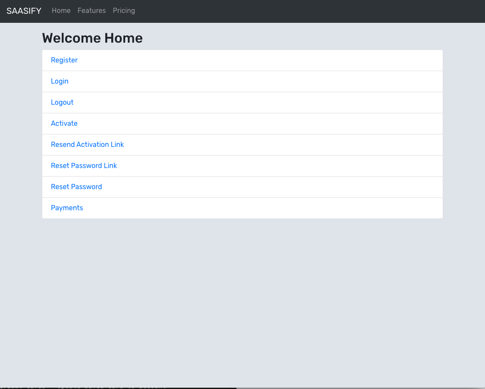
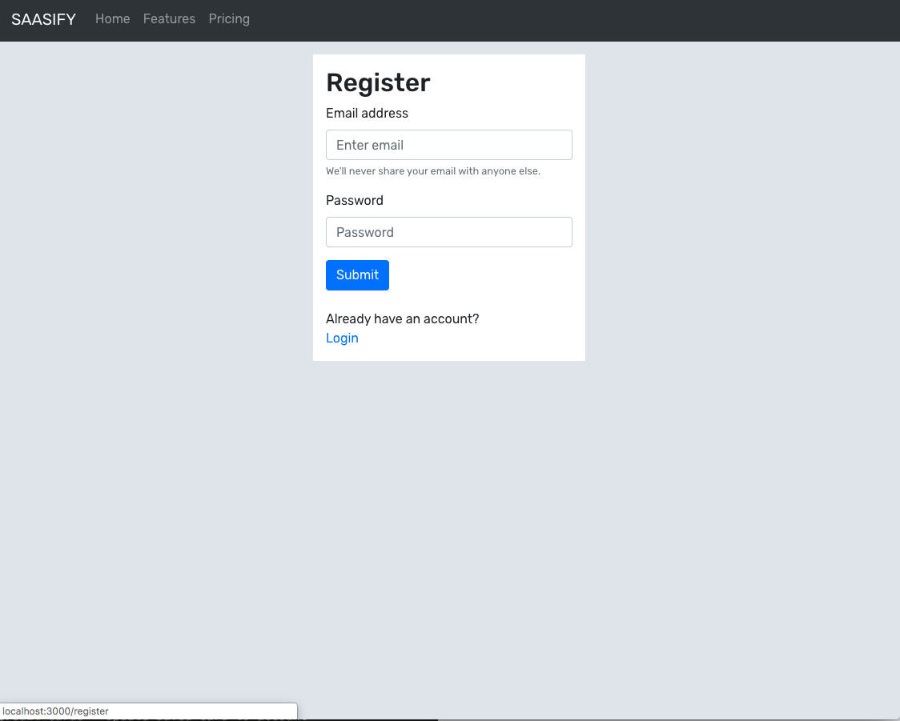
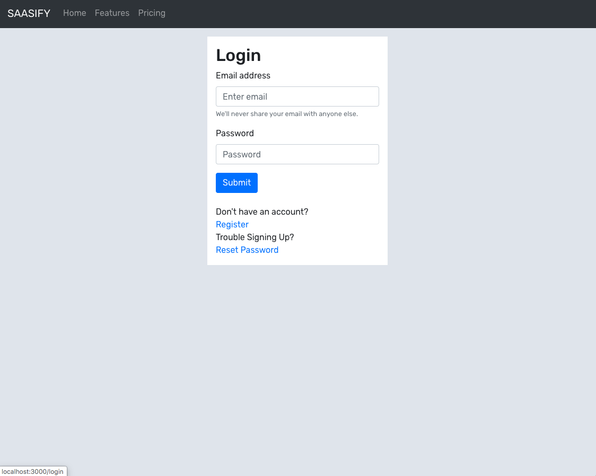
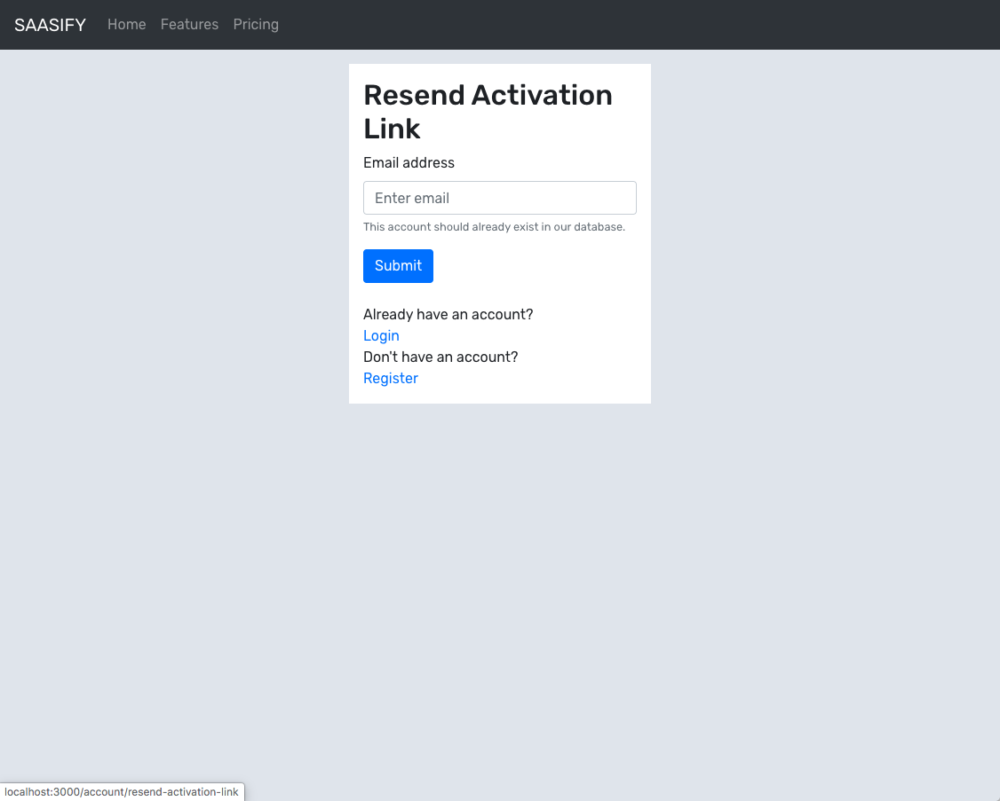
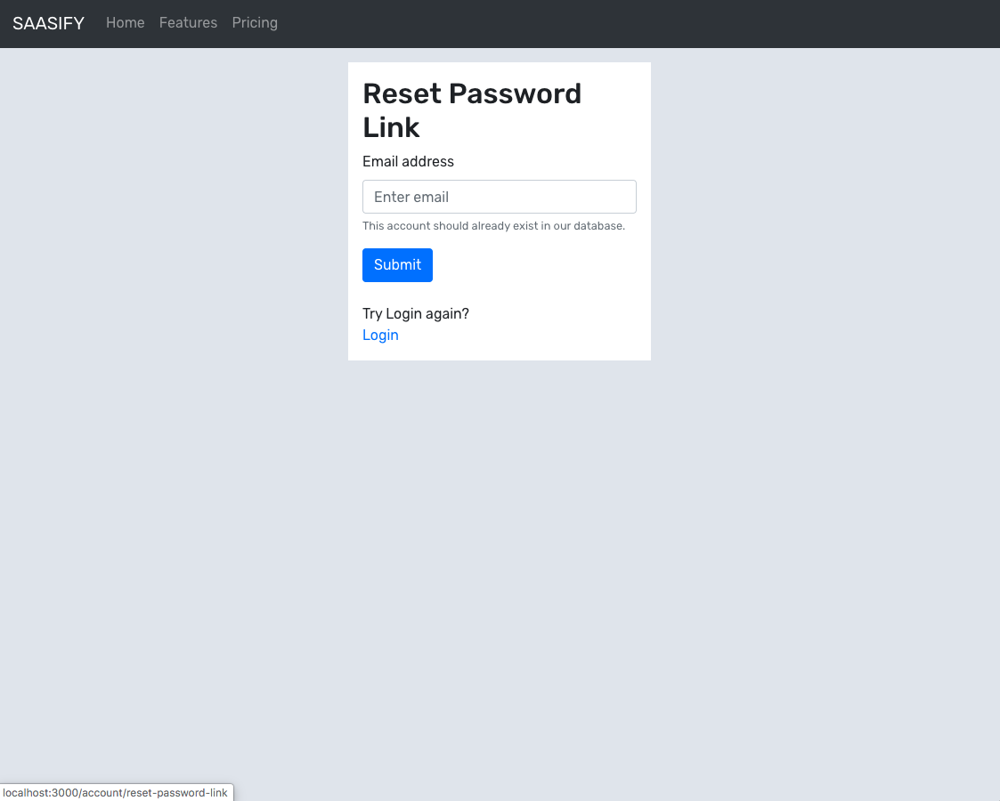
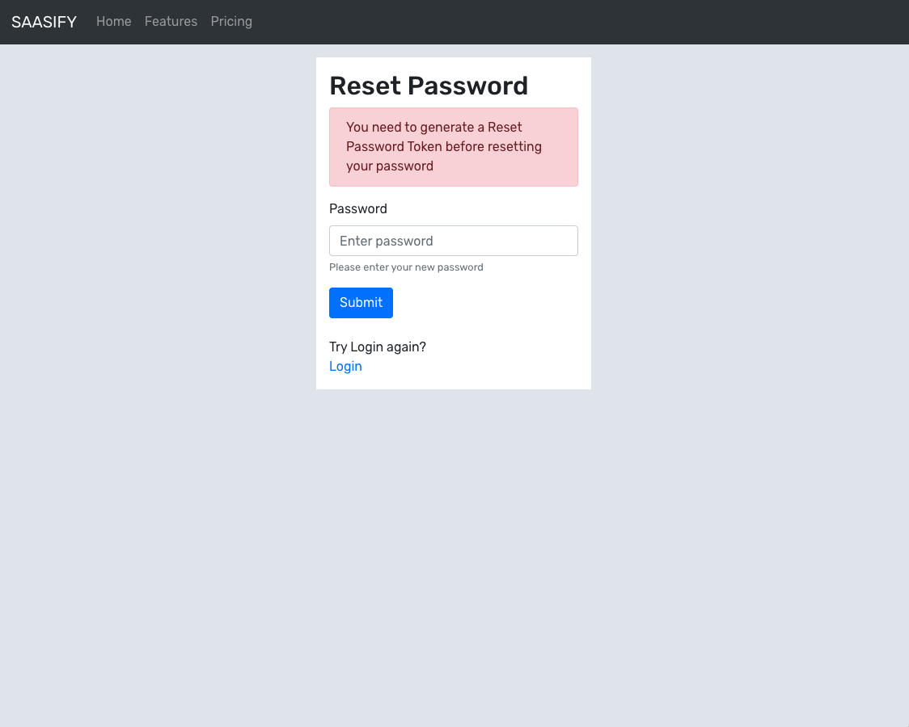
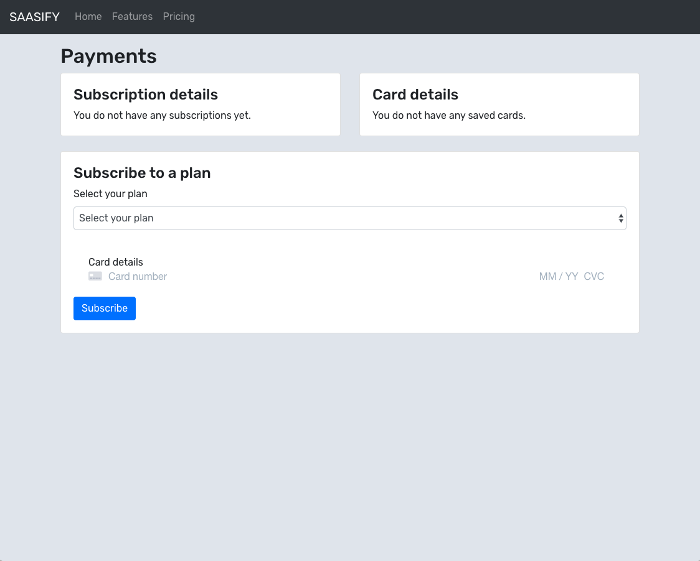

# SAASiFy

SAASiFy is a sample SAAS app built with NodeJS and ReactJS. It is primarily built for the Udemy course [SaasiFy - Build a complete SAAS App this weekend](https://www.udemy.com/course/2786970).

The commits are ordered in the same order as the videos in the course.

## Getting Started

1. Fork or clone the repository
2. You will get 2 folders -> `client` and `server`.
3. Run `npm install` from each of these folders.
4. Copy the provided `server/.env.sample` file and create a new file `server/.env`. Populate this with your values.
4. Start `client` with `npm start` inside `client` folder.
5. Start `server` with `npm start` inside `server` folder.

## Demo of all the APIs using POSTMAN
The collection is available at [https://www.getpostman.com/collections/7acbd32bce8a734cdb7d](https://www.getpostman.com/collections/7acbd32bce8a734cdb7d)

## Features/Screenshots

### Home Page

### Registration System

1. User Registers for the App
2. Send email for email address verification
3. Resend email when users don't receive it
4. Activate Account when email link is clicked

### Authentication System

1. User login
2. JWT token based auth

### Password System

1. Send email for Forgot Password
2. Allow password reset after clicking on email link

### Payments

1. Integrate with Stripe
2. Subscriptions - Subscribe to new plan
3. Subscriptions - Upgrade or Downgrade existing plan
4. Subscriptions - Unsubscribe(Delete) from all plans
5. Credit Cards - Save card to account
6. Credit Cards - Update saved card to account

### Email Integration

1. Mailgun API Integration
2. Learn to create, edit and send HTML template based emails
3. Use knowledge to send any email

### Postman APIs

1. Learn to test APIs using POSTMAN
2. Run whole application without opening browser
3. API collection provided

.